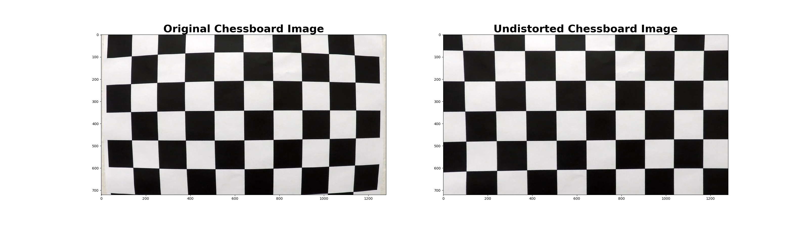
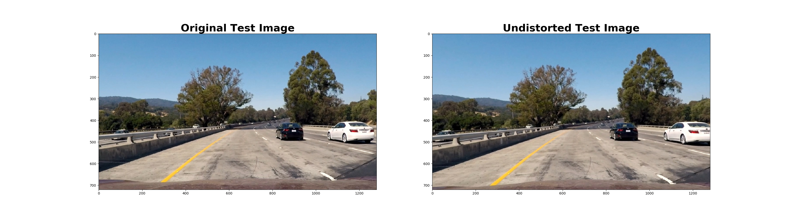
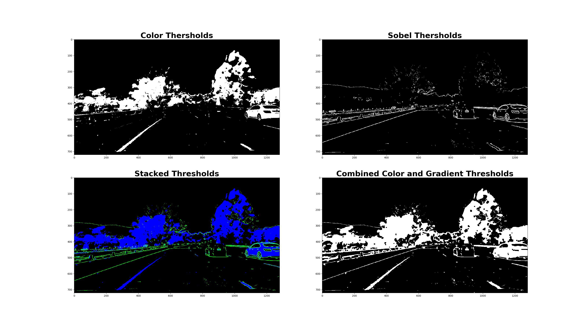
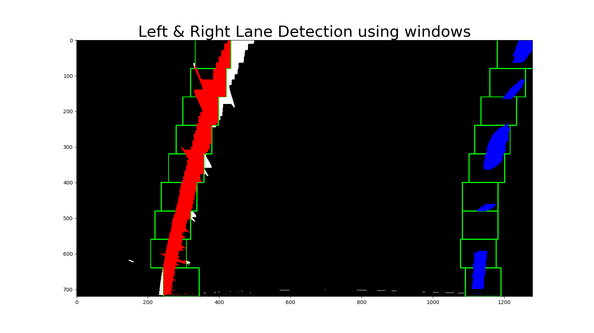
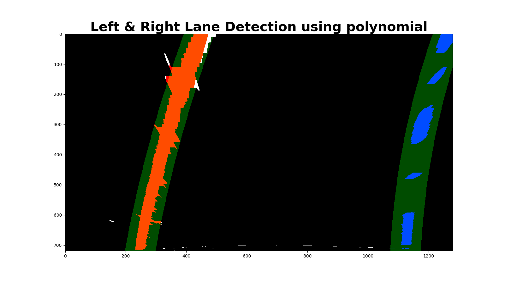

# Project2 - Advanced Lane Finding Project

## The goals / steps of this project are the following:

* Compute the camera calibration matrix and distortion coefficients given a set of chessboard images.
* Apply a distortion correction to raw images.
* Use color transforms, gradients, etc., to create a thresholded binary image.
* Apply a perspective transform to rectify binary image ("birds-eye view").
* Detect lane pixels and fit to find the lane boundary.
* Determine the curvature of the lane and vehicle position with respect to center.
* Warp the detected lane boundaries back onto the original image.
* Output visual display of the lane boundaries and numerical estimation of lane curvature and vehicle position.

## [Rubric](https://review.udacity.com/#!/rubrics/571/view)

### Camera Calibration

#### 1. Briefly state how you computed the camera matrix and distortion coefficients. Provide an example of a distortion corrected calibration image.

I seperated this step into two steps
- Step1. Calculating camera calibration values from chessboard images.   
    I started by preparing "object points", which will be the (x, y, z) coordinates of the chessboard corners in the world. I assumed that the chessboard is fixed on the (x, y) plane at z=0, such that the object points are the same for each calibration image. Thus, `objp` is just a replicated array of coordinates, and `objpoints` will be appended with a copy of it every time I successfully detect all chessboard corners in a test image. `imgpoints` will be appended with the (x, y) pixel position of each of the corners in the image plane with each successful chessboard detection.  

    Then, I used the output `objpoints` and `imgpoints` to compute the camera calibration values(Camera matrix, Distortion coefficients, Rotation vectors, Translation vectors) using the `cv2.calibrateCamera()` function and i stored those values in the global variables `mtx, dist, rvecs, tvecs`. Because, once those values are obtained, there is no need to calculate those values every time i undistort images.

- Step2. Undistort the image using camera matrix, distortion coefficients   
    After obtaining camera calibration values stored in the global variables, i undistorted images using 'cv2.cv2.undistort()`.   
   
Here's an example of my output:   


### Pipeline (single images)

#### 1. Provide an example of a distortion-corrected image.
 Once camera is calibrated, we can use calibration values. Therefore, first i calibrate the camera using `calibrateCamera()` in [`calibration.py`](calibration.py) and then undistort images using `undistortImage()` in [`calibration.py`](calibration.py).    
   
 Here's an example of distortion correction image of one of the test images:   
 
   
#### 2. Describe how (and identify where in your code) you used color transforms, gradients or other methods to create a threshold applied binary image.  Provide an example of a binary image result.
 I used a combination of color and gradient thresholds to generate a binary image. Also, I added a post-processing of image. Explanation of whole procedure is below. The function for entire binarization procedure is `cvtImg2Bin()` in [`binarization.py`](binarization.py)   
   
 - Step1. Color threshold, `threshold_color()` in [`binarization.py`](binarization.py)   
    In the lecture, we used saturation channel threshold in HLS color space. However, when i apply the image process pipeline using S channel threshold to the video `project_video.mp4`, there were some sections in the video that both lane lines are not fitted appropriately because of the shadow on the road. So i change the threshold using white and yellow color boundary in HSV colorspace in order to ignore the shadows effectively. Additionally, the thresholds of both colors are founded by manually testing.   
   
 - Step2. Gradient threshold, `threshold_gradMag()` in [`binarization.py`](binarization.py)   
    When i apply Gradient threshold, i used absolute value of magnitude of the gradient. Since Magnitude of gradient can be minus and plus value, take absolute value is necessary. Entire procedure for gradient threshold is below   
    1. Convert the image to grayscale.   
    2. Apply sobel gradient in both x and y direction.   
    3. Take magnitude of gradient   
    4. Apply threshold and make binary image   

 - Step3. Combine both threshold applied binary images   
    By using bitwise-OR operation, combine both color binary image and gradient binary image.
   
 - Step4. Morphological closing   
    After combine the binary images, since the gradient binary image is just edges, the combined image has small blank dots in lane lines. Therefore i used morphological closing 

 Here's an example of binarized image of one of the test images:    
 

#### 3. Describe how (and identify where in your code) you performed a perspective transform and provide an example of a transformed image.

 The code for my perspective transform includes a function called `warpPerspective()`, which appears in lines 32 through 70 in the file [`perspective.py`](perspective.py). The `warpPerspective()` function takes as input an binary image (`img_bin`), calculate both perspective transform matrix(`M`), inverse perspective transform matrix(`Minv`) and return warped image(`img_warped`).    
 I stored matrices in `M, Minv` global variables in the file [`perspective.py`](perspective.py). Similar with calibration matrices, both matrices can be used anytime once those are calculated. Therefore, in function `warpPerspective()`, there are codes check matrices are initialzed, if not, calculate both matrices.   
 ```python
 # Get Perspective Transform Matrix(M) and Inverse transform matrix(Minv)
 global Init, M, Minv
 if Init == False:
    M       = cv2.getPerspectiveTransform(src, dst)
    Minv    = cv2.getPerspectiveTransform(dst, src)
    Init    = True
 ```
  
 I chose the hardcode the source and destination points in the following manner:
 ```python
 src     = np.float32([[w-1, h-10],     # below right
                      [0,   h-10],      # below left
                      [546, 460],       # top   left
                      [732, 460]])      # top   right 
 dst     = np.float32([[w-1, h-1],      # below right
                      [0,   h-1],       # below left
                      [0,   0],         # top   left
                      [w-1, 0]])        # top   right
 ```
 
 This resulted in the following source and destination points:
 
 | Source        | Destination   | 
 |:-------------:|:-------------:| 
 | 1279, 710     | 1279, 710     | 
 | 0,    710     | 0,    719     |
 | 546,  460     | 0,    0       |
 | 732,  460     | 1279, 0       |
 
 I verified that my perspective transform was working as expected by drawing the `src` and `dst` points onto a test image and its warped counterpart to verify that the lines appear parallel in the warped image.
 
 ![warped straight line image][warp_result]

#### 4. Describe how (and identify where in your code) you identified lane-line pixels and fit their positions with a polynomial?
I seperate entire process into two steps
 - Step1. Detect lane pixels   
    I make two functions to detect lane lines.   
     - Method 1. detect lane line pixels using windows(`detectLanePixels_window()` in [`lineFitting.py`](lineFitting.py))   
        This method uses windows(9 windows) to detect lane pixel.   
        First, took a histogram of the bottom half of the image and obtain the base points of the bottom window. Then, find the pixels in the windows and store the indices of the pixels in windows, adjusting the base points of windows by averaging the x coordinates of the pixels right below window. After searching all activated pixels in windows, return the indices of the detected pixels.   
            
       
     - Method 2. detect lane line pixels using previous lane line polynomials(`detectLanePixels_poly()` in [`lineFitting.py`](lineFitting.py))    
         This method uses previous lane line polynomials and detect the pixels around the polynomials. Since the lane doesn't change significantly, it is better way to use previous polynomials and find pixels around them. 
         Therefore, I made a class `Line()` in [line.py](line.py) which contains polynomial coefficient buffers(`self.left_fit_recent. self.right_fit_recent`) and save recent coefficients in them. Also I made another lane line pixel detecting function `detectLanePixels_poly()` in [`lineFitting.py`](lineFitting.py)) which uses previous polynomials to detect pixels. The function algorithm is as follows.  
         Set the area of search based on the previous lane line polynomials within the +/- margin and then find the activated pixels in the area. Finally return the indices of the detected pixels.   
            


 - Step2. Fit the pixels with second order polynomials (`fitLaneLines()` in [`lineFitting.py`](lineFitting.py))   
     Using detected pixel indices and opencv function `np.polyfit`, i got coefficients of lane line polynomials. Additionally, i made a method(`Line.averageLines()`) in the class `Line()` which calculate average of the recent coefficient(`self.left_fit_recent. self.right_fit_recent`) so that lane line become smooth and store the result in (`self.left_fit_result. self.right_fit_result`).


#### 5. Describe how (and identify where in your code) you calculated the radius of curvature of the lane and the position of the vehicle with respect to center.
 - Radius of curavture
   - Mathmatical calculation of radius of curvature
   The radius of curvature at any point x of the function $x = f(y)$ is given as follows:   
   
   $$ R_{curve} = \frac{\left(\sqrt{1 + \left(\frac{dx}{dy}\right)^2}\right)^3}{\left\vert\frac{d^2x}{dy^2}\right\vert} $$
   
   In the case of the second order polynomial above, the first and second derivatives are:   
   $$ f'(y) = \frac{dx}{dy} = 2Ay + B$$
   $$ f''(y) = \frac{d^2x}{dy^2} = 2A$$
      
   So, the equation for radius of curvature becomes:   
   $$ R_{curve} = \frac{ \left(\sqrt{1 + \left(2Ay + B\right)^2}\right)^3 }{\left\vert2A\right\vert} $$

   The $y$ values of your image increase from top to bottom. I measured the radius of curvature closest to vehicle, and evaluate the formula above at the $y$ value corresponding to the bottom of the image.

   - Code for radius of curvature   
      I made a method `Line.measureRoc()` in the class `Line()` which calculates radius of curvature using average of the recent polynomial coefficients and mathmatic equation.   
      Note that, in the code, i used average coefficient of the polynomials(`self.left_fit_result. self.right_fit_result`) to calculate the curvature radius of the average lane line polynomials.

 - Position of the vehicle with respect to center
  I calculated the position of the vehicle with respect to center from the bottom of the average of the fitted lane lines. I subtracted middle point of the bottom left and right lane lines from bottom middle point of the image(640). I assumed that camera is located in the middle of the car so that bottom middle point of the image become the center of the car.

#### 6. Provide an example image of your result plotted back down onto the road such that the lane area is identified clearly.

I implemented this step in the function `warpBack()` in [`perspective.py`](perspective.py)   
This function literally warp back the image using `warpPerspective()` in `perspective.py`(perspective.py) with inverse transform matrix(`Minv` in [`perspective.py`](perspective.py)) which perviously calculated by `warpPerspective()` at the first implement of perspective transform.   
Here is an example of my result on a test image:

![warpBack_result][output_images/warpBack_result.png]

---

### Pipeline (video)

#### 1. Provide a link to your final video output.  Your pipeline should perform reasonably well on the entire project video (wobbly lines are ok but no catastrophic failures that would cause the car to drive off the road!).

Here are links to my video result
- [youtube](https://youtu.be/MKYf5nMoG8M)
- [file](output_videos/project_video.mp4)

---

### Discussion

#### 1. Briefly discuss any problems / issues you faced in your implementation of this project.  Where will your pipeline likely fail?  What could you do to make it more robust?

- Problem 1. Binarization work poorly in challege_video and harder_challenge_video.
   In the harder_challenge video, Binarization worked poorly. It detects not only lane lines but also guardrails, shadow edges and its surrounding trees eventhough i improved color threshold. Therefore, lane line fitting works poorly causing unreliable lanelines.  
   if i modify my color threshold values, it could be better, but, i think, it can't be the best solution. So i think additianal tools such as other filters or Convoulution Neural Network would be needed.
