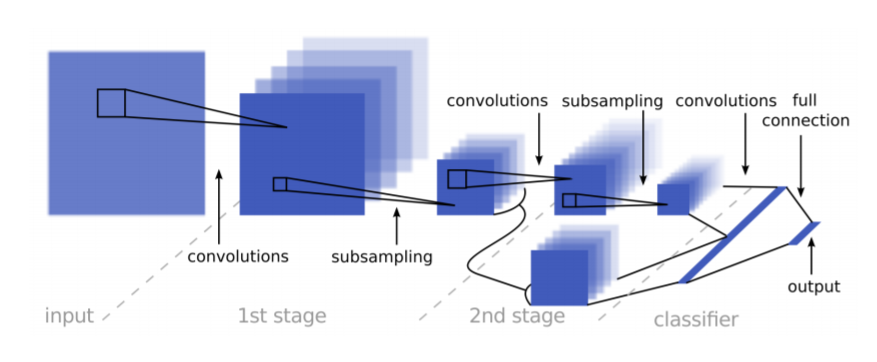

# **Traffic Sign Recognition** 

**Build a Traffic Sign Recognition Project**

The goals / steps of this project are the following:
* Load the data set (see below for links to the project data set)
* Explore, summarize and visualize the data set
* Design, train and test a model architecture
* Use the model to make predictions on new images
* Analyze the softmax probabilities of the new images
* Summarize the results with a written report

## Rubric Points
### Here I will consider the [rubric points](https://review.udacity.com/#!/rubrics/481/view) individually and describe how I addressed each point in my implementation.  

---
### Code for Google Colab
Before explanning how i implemented the project, as you can see in my code, i use Google Colab. That is because i want to make my own workspace without help of the provided workspace of udacity classroom. Since I have no GPU, i need some GPU Support Workspace with no charge. That is the reason i wrote down the codes for Colab.

In the first cell of the code, there are codes for colab.

``` python
COLAB = False

# For Colab, Activate below
# from google.colab import drive
# drive.mount('/content/gdrive')
# drive_path = '/content/gdrive/My Drive/ColabNotebooks/Udacity_SDC/Project3_TrafficSignClassifier/'

# COLAB = True
```   
When annotated codes are executed, Codes are can be used in COLAB.

### Data Set Summary & Exploration

#### 1. Provide a basic summary of the data set. In the code, the analysis should be done using python, numpy and/or pandas methods rather than hardcoding results manually.

I used the pandas library to calculate summary statistics of the traffic signs data set:

* The size of training set is ?
* The size of the validation set is ?
* The size of test set is ?
* The shape of a traffic sign image is ?
* The number of unique classes/labels in the data set is ?

#### 2. Include an exploratory visualization of the dataset.

Here is an exploratory visualization of the data set. 

1. Plotting examples of traffic sign images of all classes   
   

1. Bar chart showing how many images each classes have in train, validation, test dataset.   
   

### Design and Test a Model Architecture

#### 1. Describe how you preprocessed the image data. What techniques were chosen and why did you choose these techniques? Consider including images showing the output of each preprocessing technique. Pre-processing refers to techniques such as converting to grayscale, normalization, etc. (OPTIONAL: As described in the "Stand Out Suggestions" part of the rubric, if you generated additional data for training, describe why you decided to generate additional data, how you generated the data, and provide example images of the additional data. Then describe the characteristics of the augmented training set like number of images in the set, number of images for each class, etc.)

In the Preprocessing Step, I followed the steps introduced by [Sermanet & LeCun(2011)](http://yann.lecun.com/exdb/publis/pdf/sermanet-ijcnn-11.pdf)   

**Preprocess Image**   
1. Convert the image to YUV Color space
2. Choose Y channel
3. Apply CLAHE(Contrast limited Adaptive Histogram Equalization) to normalize the contrast
4. Expand array to represent single channel (32x32 -> 32x32x1)   


By equalizing the histogram of the image, contrast in the images improve significantly as can be seen above figure. That leads to improve the accuracy of my model.

**Preprocess Dataset**
1. Preprocess all images in the dataset
2. Calculate the average and standard deviation of th train dataset globally
3. Standardize Datasets(Trainning set, Validation Set, Test Set) using the average and standard deviation of th train dataset globally
4. Shuffle the train set

#### 2. Describe what your final model architecture looks like including model type, layers, layer sizes, connectivity, etc.) Consider including a diagram and/or table describing the final model.

My final model consisted of the following layers:

| Layer         		|     Description	        					                    |
|:---------------------:|:-----------------------------------------------------------------:|
| Input         		| 32x32x1 histogram equlized & standardized image	                |
| Convolution_1 5x5    	| 1x1 stride, valid padding, outputs 28x28x108 	                    |
| RELU					|												                    |
| Max pooling_1 2x2    	| 2x2 stride, outputs 14x14x108			                            |
| Convolution_2 5x5    	| 1x1 stride, valid     padding, outputs 10x10x108 	                |
| RELU					|												                    |
| Max pooling_2 2x2    	| 2x2 stride, outputs 5x5x108 				                        |
| Concat & Flatten		| Concatenate Conv_1 & Conv2 and Flatten the Layer, outputs 23868   |
| Dropout				|												                    |
| Fully connected		| outputs 100        							                    |
| RELU					|												                    |
| Dropout				|												                    |
| Fully connected		| outputs 84        							                    |
| RELU					|												                    |   
| Dropout				|												                    |
| Fully connected		| outputs 43        							                    |
| RELU					|												                    |
| Dropout				|												                    |
| Softmax				|         									                        |
 
I build the model which is almost simillar with the model introduced by [Sermanet & LeCun(2011)](http://yann.lecun.com/exdb/publis/pdf/sermanet-ijcnn-11.pdf).  

   

Interestingly, they used Multi-Scale Feature according to [Sermanet & LeCun(2011)](http://yann.lecun.com/exdb/publis/pdf/sermanet-ijcnn-11.pdf). In the model, the output of the first convolution layer is branched out and fed to the classifier, in addition to the output of the second stage.

#### 3. Describe how you trained your model. The discussion can include the type of optimizer, the batch size, number of epochs and any hyperparameters such as learning rate.

I used Adam optimizer, batch_size = 256, 250 Epochs and learning rate = 0.001.   


#### 4. Describe the approach taken for finding a solution and getting the validation set accuracy to be at least 0.93. Include in the discussion the results on the training, validation and test sets and where in the code these were calculated. Your approach may have been an iterative process, in which case, outline the steps you took to get to the final solution and why you chose those steps. Perhaps your solution involved an already well known implementation or architecture. In this case, discuss why you think the architecture is suitable for the current problem.

My final model results were:
* training set accuracy of ?
     - 100%
* validation set accuracy of ? 
     - 98.8%
* test set accuracy of ?
     - 97.8%

If an iterative approach was chosen:
* What was the first architecture that was tried and why was it chosen?
     First, I chose the Lenet-5 architechture to try to use what i've learned.   

* What were some problems with the initial architecture?
     The main problem was overfitting. the gap between the accuracy of trainning set and validation set was large. Also accuracy is quite low to submit.(vaildation accuracy = 0.866)

* How was the architecture adjusted and why was it adjusted? Typical adjustments could include choosing a different model architecture, adding or taking away layers (pooling, dropout, convolution, etc), using an activation function or changing the activation function. One common justification for adjusting an architecture would be due to overfitting or underfitting. A high accuracy on the training set but low accuracy on the validation set indicates over fitting; a low accuracy on both sets indicates under fitting.
  - Try 1
    - Add Dropout Layer after each fully connected layers of Lenet-5
    - Validation accuracy = 0.942
  - Try 2
    - Preprocess the dataset by applying CLAHE(Contrast Limited Adative Histogram Equalization)
    - Validation accuracy = 0.961
  - Try 3
    - Preprocess the dataset by applying CLAHE and Data standardization
    - Validation accuracy = 0.970

    **I thought this is the best accuracy which can be obtained by using the Lenet-5. Therefore, i decided to choose different model.**   

  - Try 4
    - Choose different model architechure introduced by [Sermanet & LeCun(2011)](http://yann.lecun.com/exdb/publis/pdf/sermanet-ijcnn-11.pdf)
    - Add dropout layers after fully connected layers
    - Preprocess the dataset by applying CLAHE and Data standardization
    
* Which parameters were tuned? How were they adjusted and why?
     - The number of first and second convolution kernel are adjusted to 108-108 and hidden layer size is chosen by 100. According to [Sermanet & LeCun(2011)](http://yann.lecun.com/exdb/publis/pdf/sermanet-ijcnn-11.pdf), those parameters yield best accuracy of the architecture, so i adopted them.

* What are some of the important design choices and why were they chosen? For example, why might a convolution layer work well with this problem? How might a dropout layer help with creating a successful model?
     - In this problem, the model should classify the bunch of images. Therfore CNN which is motivated by human image recongnition is good choice to design neural networks.
     -  Dropout layer also needed in order to avoid overshoot.

If a well known architecture was chosen:
* What architecture was chosen?
     - Last Try(Try 4) was chosen.

* Why did you believe it would be relevant to the traffic sign application?
     - In order to make self-driving car, traffic sign classification is necessary. When planning the path of the vehicle, traffic sign is needed to judge the situation around the vehicle. If traffic sign is not correctly classified, it can lead to bad path planning and can cause serious safety problems. Therefore, traffic sign classification is relevant to the application.

* How does the final model's accuracy on the training, validation and test set provide evidence that the model is working well?
     - training set accuracy    = 100%
     - validation set accuracy  = 98.8%
     - test set accuracy        = 97.8%

### Test a Model on New Images

#### 1. Choose five German traffic signs found on the web and provide them in the report. For each image, discuss what quality or qualities might be difficult to classify.

Here are five German traffic signs that I found on the web:

  
 

#### 2. Discuss the model's predictions on these new traffic signs and compare the results to predicting on the test set. At a minimum, discuss what the predictions were, the accuracy on these new predictions, and compare the accuracy to the accuracy on the test set (OPTIONAL: Discuss the results in more detail as described in the "Stand Out Suggestions" part of the rubric).

Here are the results of the prediction:

| Image			                                |     Prediction	        					| 
|:---------------------------------------------:|:---------------------------------------------:| 
| Vehicles over 3.5 metric tons prohibited    	| Vehicles over 3.5 metric tons prohibited    	| 
| No entry					                    | No entry					                    |
| Right-of-way at the next intersection     	| Right-of-way at the next intersection     	|
| Ahead only	      		                    | Ahead only	      		                    |
| Speed limit (30km/h)			                | Speed limit (30km/h)			                |


The model was able to correctly guess 5 of the 5 traffic signs, which gives an accuracy of 100%.

#### 3. Describe how certain the model is when predicting on each of the five new images by looking at the softmax probabilities for each prediction. Provide the top 5 softmax probabilities for each image along with the sign type of each probability. (OPTIONAL: as described in the "Stand Out Suggestions" part of the rubric, visualizations can also be provided such as bar charts)

The top five soft max probabilities were

| Probability         	|     Prediction	        					| 
|:---------------------:|:---------------------------------------------:| 
| .982         			| Vehicles over 3.5 metric tons prohibited    	| 
| 1.00     				| No entry					                    |
| 1.00					| Right-of-way at the next intersection     	|
| 1.00	      			| Ahead only	      		                    |
| 1.00				    | Speed limit (30km/h)			                |

