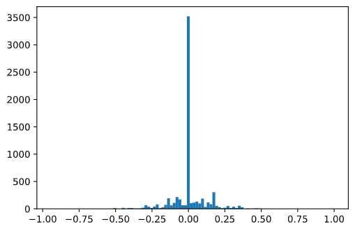
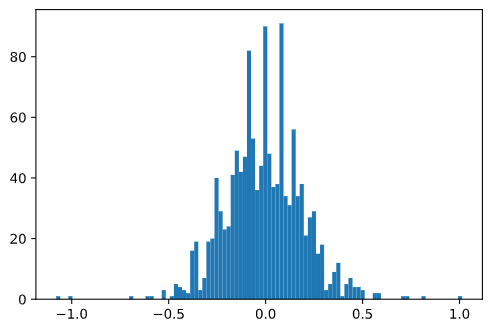
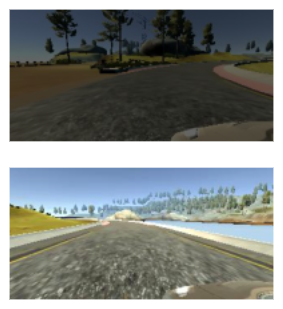

# **Behavioral Cloning** 

## **Behavioral Cloning Project**

The goals / steps of this project are the following:
* Use the simulator to collect data of good driving behavior
* Build, a convolution neural network in Keras that predicts steering angles from images
* Train and validate the model with a training and validation set
* Test that the model successfully drives around track one without leaving the road
* Summarize the results with a written report

## Rubric Points
### Here I will consider the [rubric points](https://review.udacity.com/#!/rubrics/432/view) individually and describe how I addressed each point in my implementation.  

---
### Files Submitted & Code Quality

#### 1. Submission includes all required files and can be used to run the simulator in autonomous mode

My project includes the following files:
* [model.py](model.py) containing the script to create and train the model
* [dataPreprocess.py](dataPreprocess.py) containing the codes to preprocess train data
* [config.py](config.py) containing configuration variables such as batchsize, etc...
* [drive.py](drive.py) for driving the car in autonomous mode of the UDC simulator
* [model.h5](model.h5) containing a trained convolution neural network 
* [README.md](README.md) summarizing the results

#### 2. Submission includes functional code
Using the Udacity provided simulator and my drive.py file, the car can be driven autonomously around the track by executing 
```sh
python drive.py model.h5
```

#### 3. Submission code is usable and readable

The [model.py](model.py) file contains the code for training and saving the convolution neural network. The file shows the pipeline I used for training and validating the model, and it contains comments to explain how the code works.

### Model Architecture and Training Strategy

#### 1. An appropriate model architecture has been employed

I employed the model of NVIDIA in the [paper](https://arxiv.org/pdf/1604.07316v1.pdf) consists of 5 convolution layers and 4 Dense layers.
||
|:---:|
|Nvidia Network|
Also I used RELU as activation function which is not decribed in the paper. 

The data is normalized and cropped in the model using a Keras lambda layer. Full model of mine is below.
```
_________________________________________________________________
Layer (type)                 Output Shape              Param #   
=================================================================
lambda_1 (Lambda)            (None, 160, 320, 3)       0         
_________________________________________________________________
cropping2d_1 (Cropping2D)    (None, 120, 320, 3)       0         
_________________________________________________________________
conv2d_1 (Conv2D)            (None, 58, 158, 24)       1824      
_________________________________________________________________
conv2d_2 (Conv2D)            (None, 27, 77, 36)        21636     
_________________________________________________________________
conv2d_3 (Conv2D)            (None, 12, 37, 48)        43248     
_________________________________________________________________
conv2d_4 (Conv2D)            (None, 5, 35, 64)         27712     
_________________________________________________________________
conv2d_5 (Conv2D)            (None, 2, 33, 64)         36928     
_________________________________________________________________
flatten_1 (Flatten)          (None, 4224)              0         
_________________________________________________________________
dropout_1 (Dropout)          (None, 4224)              0         
_________________________________________________________________
dense_1 (Dense)              (None, 100)               422500    
_________________________________________________________________
dropout_2 (Dropout)          (None, 100)               0         
_________________________________________________________________
dense_2 (Dense)              (None, 50)                5050      
_________________________________________________________________
dropout_3 (Dropout)          (None, 50)                0         
_________________________________________________________________
dense_3 (Dense)              (None, 10)                510       
_________________________________________________________________
dense_4 (Dense)              (None, 1)                 11        
=================================================================
Total params: 559,419
Trainable params: 559,419
Non-trainable params: 0
_________________________________________________________________
```

#### 2. Attempts to reduce overfitting in the model

 The model contains dropout layers in order to reduce overfitting (as you can see above). 

 The model was trained and validated on provided data set in UDC workspace. For model not to be overfitted, i add some dropout layers after the flatten layer and dense layers except last one. Since last dense layer only has 10 nodes, i didn't added dropout layer after last dense layer.

 The model was tested by running it through the simulator and ensuring that the vehicle could stay on the track.

#### 3. Model parameter tuning

 The model used an adam optimizer, so the learning rate was not tuned manually.

#### 4. Appropriate training data

Training data was chosen to keep the vehicle driving on the road. I used the center lane driving dataset provided in workspace. It was hard to control the simulator, so i gave up to make train data. Therefore, the only dataset i had was the provided one in workspace.(about 8000 images per camera)

For details about how I created the training data, see the next section. 

### Model Architecture and Training Strategy

#### 1. Solution Design Approach

**Use Nvidia Model**
My first step was to use a convolution neural network model similar to the model in Nvidia [paper](https://arxiv.org/pdf/1604.07316v1.pdf) I thought this model might be appropriate because the model was also used to estimate steering angle from left, center, right camera.
||
|:---:|
|Nvidia Network|

In the model, the input size is `66*200*3` which is different with our input image size, `160*320*3`. So i made resize layer,
```python
...
def resizeImg(image):
    # This import is required here otherwise 
    import tensorflow as tf  the model cannot be loaded in drive.py
    return tf.image.resize_nearest_neighbor(image, (66, 200) )
...

...
model.add(Cropping2D(cropping=((20, 20), (0, 0)), input_shape=(h,w,c)))
model.add(Lambda(resizeImg))
model.add(Lambda(lambda img: img / 127.5 - 1.) )
...
```
However, the performance of the model was better without resizing layer so i eliminate it. Instead, i adjust the strides of last two convolution layers from `(1, 1)` to `(2, 1)` to make similar with Nvidia Model.

```python
### model.py
...
model.add(Conv2D(24, kernel_size = (5, 5), strides= (2, 2), padding= 'valid', activation='relu'))
model.add(Conv2D(36, kernel_size = (5, 5), strides= (2, 2), padding= 'valid', activation='relu'))
model.add(Conv2D(48, kernel_size = (5, 5), strides= (2, 2), padding= 'valid', activation='relu'))
model.add(Conv2D(64, kernel_size = (3, 3), strides= (2, 1), padding= 'valid', activation='relu'))
model.add(Conv2D(64, kernel_size = (3, 3), strides= (2, 1), padding= 'valid', activation='relu'))
...
```

**Normalizing & Cropping Layer**
In the image, i cropped 20 pixels above and below the image which is not needed to train the model. Also to enhance the training i normalize the image before convolution.

**Dataset**
In order to gauge how well the model was working, I split the images and steering angle data into a training and validation set. The images for validation set used only center images without any preprocessing.

To combat the overfitting, I modified the model. I added some dropout layers after the flatten layer and dense layers except last one. Since last dense layer only has 10 nodes, i didn't added dropout layer after last dense layer.

Then I augmented trainning dataset by applying some preprocess steps. Details will be described below.

The final step was to run the simulator to see how well the car was driving around track one. There were a few spots where the vehicle fell off the track. But i improved the driving behavior by adding some prerocessed images of trainning set.

At the end of the process, the vehicle is able to drive autonomously around the track without leaving the road.

#### 2. Final Model Architecture

The final model architecture consisted of a convolution neural network with the following layers and layer sizes.
```
______________________________________________________________
Layer (type)                 Output Shape              Param #   
=================================================================
lambda_1 (Lambda)            (None, 160, 320, 3)       0         
_________________________________________________________________
cropping2d_1 (Cropping2D)    (None, 120, 320, 3)       0         
_________________________________________________________________
conv2d_1 (Conv2D)            (None, 58, 158, 24)       1824      
_________________________________________________________________
conv2d_2 (Conv2D)            (None, 27, 77, 36)        21636     
_________________________________________________________________
conv2d_3 (Conv2D)            (None, 12, 37, 48)        43248     
_________________________________________________________________
conv2d_4 (Conv2D)            (None, 5, 35, 64)         27712     
_________________________________________________________________
conv2d_5 (Conv2D)            (None, 2, 33, 64)         36928     
_________________________________________________________________
flatten_1 (Flatten)          (None, 4224)              0         
_________________________________________________________________
dropout_1 (Dropout)          (None, 4224)              0         
_________________________________________________________________
dense_1 (Dense)              (None, 100)               422500    
_________________________________________________________________
dropout_2 (Dropout)          (None, 100)               0         
_________________________________________________________________
dense_2 (Dense)              (None, 50)                5050      
_________________________________________________________________
dropout_3 (Dropout)          (None, 50)                0         
_________________________________________________________________
dense_3 (Dense)              (None, 10)                510       
_________________________________________________________________
dense_4 (Dense)              (None, 1)                 11        
=================================================================
Total params: 559,419
Trainable params: 559,419
Non-trainable params: 0
_________________________________________________________________
```

#### 3. Creation of the Training Set & Training Process

As i mentioned, i only use dataset provided in workspace which only has about 8000 images per camera.

**Exclude 90% of `steer == 0` Data**   
After building the model, i trained the model with the center images and simulate it. The car was go well on the straight line but when it met first curve, it just go straight and went off the course.

I found that about 53% of data was `steer == 0`. And i visualized the steer histogram and see the distribution of the steer data. The below historgram is steer data in the trainset(size = 6428).   



I supposed this bias made my model to be fool. So i exclude 90% of steer==0 data when making the batch dataset.
```python
# dataPreprocess.py
...
# Exclude 90% of steer == 0 data
if steer == 0:
    if np.random.rand() > 0.1:
        continue
    else:
        ...
...
```

**Use Left, Right Camera Images with adjusted steering**   
Only half of data remains after excluding `steer == 0` data. More data is needed to train the model. Therefore, i used left, right camera images with steering data which is added or subtracted by `delta_correction` in [config.py](config.py).

||||
|:---:|:---:|:---:|
|Left image|Center image|Right image|

```python
# dataPreprocess.py
...
# randomly choose which camera to use among (central, left, right)
# when chosen camera is not the front one, correct steer
camera              = random.choice(['front', 'left', 'right'])
if camera == 'front':
    f       = ct_path.split('/')[-1]
    image   = np.float32(cv2.imread(PATH + f))
    steer   = steer
elif camera == 'left':
    f       = lt_path.split('/')[-1]
    image   = np.float32(cv2.imread(PATH + f))
    steer   = steer + delta_correction
elif camera == 'right':
    f       = rt_path.split('/')[-1]
    image   = np.float32(cv2.imread(PATH + f))
    steer   = steer - delta_correction
```

**Use Flipped Images**   
I also use flipped image to train the model. This makes model being trainned in the different track. In the code, i flipped image and reverse the sign of steering with 50% probability.
```python
# dataPreprocess.py
...
# mirror images with chance=0.5
if random.choice([True, False]):
    image   = image[:, ::-1, :]
    steer   *= -1.
...
```

Here is the steering data distribution after applying all steps above




**Change Brightness of the Images**   
After applying all steps above, i trained my model and it works pretty well! But when the car met the shadows above the road, the car went off the track.

So i made add steps to change brightness of the images, in order for my model to keep on the track regardless of the shadows on the track.

```python
# dataPreprocess.py
...
# Randomly change brightness
if CONFIG['input_channels'] == 3:
    image          = cv2.cvtColor(image, code=cv2.COLOR_BGR2HSV)
    image[:, :, 2] *= random.uniform(CONFIG['augmentation_value_min'], CONFIG['augmentation_value_max'])
    image[:, :, 2] = np.clip(image[:, :, 2], a_min=0, a_max=255)
    image = cv2.cvtColor(image, code=cv2.COLOR_HSV2BGR)
...
```
||
|:---:|
|Random brightness changed image|


**Shuffle Dataset & Split training and Validation Set**   
Lastly, I randomly shuffled the data set and put 20% of the data into a validation set.    
Preprocessing step is applied only to tranning set in order to test the model. The validation set helped determine if the model was over or under fitting. 

**Training Details**   
The ideal number of epochs was 15 for my trainning set with batch size 1285 which is 20% of the trainning set. Each epoch contains 5 steps for a batch. I used an adam optimizer so that manually training the learning rate wasn't necessary.

Also the `delta_correction` was `0.08` and brightness is multiplied randomly from `0.2` to `1.5`

**Example of Final Result**   


(Full Video : [Youtube](https://youtu.be/JtHwKQwcniQ))

