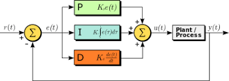

# CarND-Controls-PID
This projects implements a PID controller for keeping the car on track by appropriately adjusting the steering angle.

## Overview
P control | PI contorl | PID control
:--------:|:----------:|:----------:
||

## What's a PID controller
A proportional–integral–derivative controller (PID controller) is one of the most common control loop feedback mechanisms. A PID controller continuously calculates an error value as the difference between a reference value and a measured value (which in our case is the distance from the center of the lane) and applies a correction based on proportional (P), integral (I), and derivative (D) terms.
<center>

   

</center>

## Choosing PID Parameters
The behavior of a PID controller depends on three main parameters, namely the proportional, integral and derivative gain. Each one of these three parameters controls the strength of the respective controller's response.

- **Proportional gain (P)** is proportional to the current value of error(reference value - meaured value). In this project error is ego car's distance from the center lane(d_ref - d_car). If the error is large and positive, the control output will be proportionately large and positive. If the proportional gain(K_p) gets bigger, the car steers its heading more aggressively causing instability like above gif.

- **Integral gain (I)** accounts for past values of the  errors and integrates them over time to produce the I term. The integral term seeks to eliminate the residual steady-state error by adding a control effect due to the historic cumulative value of the error (a purely proportional controller operates only when error is non-zero). Also, by adding integral term, it is able to deal with systematic biases. However, it can cause large overshoot because it is literally proportional to the accumulated errors.
     
- **Derivative gain (D)**  decides how much the error's rate of change is taken into account when computing the response. In other words, if the error changes rapidly, the response become bigger so that rate of change become smaller. Therefore, Derivative component benefits the system's stability and settling time.   
   
In this project, parameters have been manually tuned by qualitatively inspecting the driving behaviour in the simulator in response to parameter's changes.

---

## Dependencies

* cmake >= 3.5
 * All OSes: [click here for installation instructions](https://cmake.org/install/)
* make >= 4.1(mac, linux), 3.81(Windows)
  * Linux: make is installed by default on most Linux distros
  * Mac: [install Xcode command line tools to get make](https://developer.apple.com/xcode/features/)
  * Windows: [Click here for installation instructions](http://gnuwin32.sourceforge.net/packages/make.htm)
* gcc/g++ >= 5.4
  * Linux: gcc / g++ is installed by default on most Linux distros
  * Mac: same deal as make - [install Xcode command line tools]((https://developer.apple.com/xcode/features/)
  * Windows: recommend using [MinGW](http://www.mingw.org/)
* [uWebSockets](https://github.com/uWebSockets/uWebSockets)
  * Run either `./install-mac.sh` or `./install-ubuntu.sh`.
  * If you install from source, checkout to commit `e94b6e1`, i.e.
    ```
    git clone https://github.com/uWebSockets/uWebSockets 
    cd uWebSockets
    git checkout e94b6e1
    ```
    Some function signatures have changed in v0.14.x. See [this PR](https://github.com/udacity/CarND-MPC-Project/pull/3) for more details.
* Simulator. You can download these from the [project intro page](https://github.com/udacity/self-driving-car-sim/releases) in the classroom.

Fellow students have put together a guide to Windows set-up for the project [here](https://s3-us-west-1.amazonaws.com/udacity-selfdrivingcar/files/Kidnapped_Vehicle_Windows_Setup.pdf) if the environment you have set up for the Sensor Fusion projects does not work for this project. There's also an experimental patch for windows in this [PR](https://github.com/udacity/CarND-PID-Control-Project/pull/3).

## Basic Build Instructions

1. Clone this repo.
2. Make a build directory: `mkdir build && cd build`
3. Compile: `cmake .. && make`
4. Run it: `./pid`. 

Tips for setting up your environment can be found [here](https://classroom.udacity.com/nanodegrees/nd013/parts/40f38239-66b6-46ec-ae68-03afd8a601c8/modules/0949fca6-b379-42af-a919-ee50aa304e6a/lessons/f758c44c-5e40-4e01-93b5-1a82aa4e044f/concepts/23d376c7-0195-4276-bdf0-e02f1f3c665d)

## Code Style

Please (do your best to) stick to [Google's C++ style guide](https://google.github.io/styleguide/cppguide.html).

## Project Instructions and Rubric

Note: regardless of the changes you make, your project must be buildable using
cmake and make!

More information is only accessible by people who are already enrolled in Term 2
of CarND. If you are enrolled, see [the project page](https://classroom.udacity.com/nanodegrees/nd013/parts/40f38239-66b6-46ec-ae68-03afd8a601c8/modules/f1820894-8322-4bb3-81aa-b26b3c6dcbaf/lessons/e8235395-22dd-4b87-88e0-d108c5e5bbf4/concepts/6a4d8d42-6a04-4aa6-b284-1697c0fd6562)
for instructions and the project rubric.